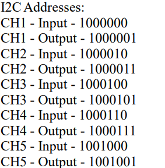

# Plan
## Introduction (DO NOT EDIT)
This is the firmware for a GaN MPPT device with 5 seperate channels. I am writing this document because I feel like I do not understand the way the firmware is going, nor do you understand what I want this to be.

## Agent Instructions (DO NOT EDIT)
This is an eductional experience, and in fact my first introduction to designing firware from the ground up. At work, I have worked and modified firmwares for other devices such as ESC, but I have never designed it from the ground up. With this being the case, I would like you to push me to learn, rather then just doing everything for me. However, what I would like you to do is design the bare interfaces, such as what we have already done with the PWM hal abstraction, and the INA drivers. 

Simplicity and visibility is the goal here, continue on with the current folder structure. Lean towards simple and verifiable solutions, rather then complex optimisations. Saftey is critical, firmware functions that cause the PWM duty cycle to go high have the potential to damage the board itself, although this is unlikely with the current interrupts.

I would prefer to use cube mx to configure pin settings, do not configure these yourself unless necessary, and instead tell me what to change in cube mx. Additionally, DO NOT edit the cube mx generated code in any way. You are only allowed to write inside the cube functions.

Append additional context to this file, do not edit sections with "DO NOT EDIT" unless we discuss and deem it to be useful.

This file alongisde the codebase is the main source of truth, and anything else in .agents. Consider the fact that I will be using both GPT5.6 SOL and CLAUDE OPUS 5 in writing this, so avoid model specific memory locations, and instead make a new file inside .agents to store information.

## Hardware Context
As mentioned before, this MPPT system is based on a STM32H743ZIT6 microcontroller. This microcontroller controls 5 synchronous boost converter channels with the HRTIM complementary PWM outputs. There is a number of sensors, communication interfaces, and other devices on the board, which I will summarise the function of below. The pins are initialised in cube MX.

### Timers and Boost channels
All channel control is using the HRTIM timers, 5 channels, complementary pairs. These are clocked at 480 MHz for optimal dead time resolution. We must have the ability to control the frequency, duty cycle, and deadtime. Although, in the beginning, deadtime and frequenecy will be fixed. 

These timers drive 5 synchronous boost converters, each channel will be boosting a PV input (Voc = 30.5 V, Isc = 8.66 A, Vmpp = 27.59 V, Impp = 8.22 A) to a battery bus (Vmin = 32.5 V, Vnom = 46.8 V, Vmax = 54.6 V).

### Protection
Each boost channel has an overcurrent protection trigger that causes a FLT pin to go high when the inductor current exceeds 12A. These are fed into the HRTIM_FLTX pins.

There is also a comparator that triggers OVP protection pin when the bus voltage exceeds 55V, which should shut the channels down.

### Power Sensors
Each channel has two INA228 sensors with 3 mOhm shunts. These monitor the input and output power. The addresses are attached below.

### Bus voltage sensor
Directly on the battery bus (before ideal diode) there is a 100 kOhm top resistor and 5.23kOhm base resistor divider. This feeds the V_BUS adc. Used for telemetry.

### Temperature sensors
On each channel there is a 10kohm NTC connected to ground and the ADC pin (NTC_X), there is a 10kOhm 3.3V pull up. Used for telemetry.

### Fast current sensor
On each channel there is a analog current sensor across the 3 mOhm shunt. This may not end up being used, but is intended for implementing control for inductor current. The INA228 current sensor will be used for the MPPT algorithm.

### LED
There is a toggle LED for each channel (LED_TOG_X) which will be RED for off when GPIO is high, and GREEN for on when GPIO is low.

There is 3 system status LED, which will turn on when GPIO is pulled high. LED_ERR, LED_OUT_CONN, and LED_ACTIVE. 
ERR will turn on if there is any fault.
OUT_CONN will turn on, if a voltage above 32.5V is sensed from the bus voltage sensor.
ACTIVE will turn on if any channel is on.

### FDCAN
There are two FDCAN transceivers. This is to broadcast telem to the central car computer, and maybe to do some state control or something later. Only FDCAN 1 will be used actively initially.

### Serial
This is the primary debug interface. A gui or terminal will be used to see telem, and test the device or perform evaluation. Some or all of the functionality will be present in production firmware.

### Oscillator
There is a 8 MHz crystal oscillator attached to the RCC pins.

### Injection switch
There is an ideal diode from the output of the boost converters to the battery connection to prevent major inrush current. This means current cannot flow from the battery bus back to the solar panels.

For EL imaging, we may want to inject current into the solar panels through the MPPT, therefore a INJECT_EN GPIO controls a switch, this should be low and not used for now, but later when this mode is added we will turn this on to bypass the ideal diode.

### I2C
Dual I2C interfaces, all INA devices appear on I2C1 interface, hardware option to split the 10 sensors across two I2C interfaces but this will not be used.

### Other Hardware Notes
This is a sensitive system, and relies on appropriate firmware measures. The PWM duty cycle must have clear saturation thesholds in the PWM abstraction layer. This threshold should mean that PWM DC can never exceed a given percentage, that you will calculate and add here based on the system voltages.

Additionally, initial testing shows that sharp changes in the duty cycle triggers OCP protection, so we must apply a ramp rate parameter to this change. We will lock and protect hardware sensitve features in an abstraction layer like PWM.c and intterupts.c.

## Firmware Architecture
We will discuss and work this out. I would like the whole system to be a FSM with clear, distinct states. Simplicity and clean and understandable code is here, with the ability to play around with control algorithms and methods. Ideally, I would like a configuration interface to set parameters like ramp rate and theshold values. This will be realised in a file like we have already for config.h. However, stuff that is related to hardware that will never change should be hardcoded like LED polarity.
